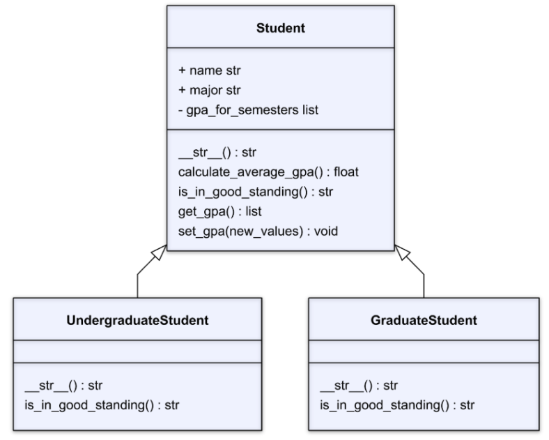

# COMPS III: Assignment #3 - Polymorphism and Encapsulation

## Instructions

**TASK**: Create a `Student` parent class and two child classes (`UndergraduateStudent` and `GraduateStudent`). `Student` class has private attribute with relevant getter and setter methods. The `UndergraduateStudent` and `GraduateStudent` classes should override two of the methods present in the `Student` class.



Your `Student` class should have the following attributes and methods:
- **Attribute**
    - `name (string)`: A string that contains the individual’s name.
    - `major (string)`:  An integer containing the individual’s age.
    - `gpa_for_semesters (list)`: A list of GPAs values earned by the student. This attribute is private.
- **Methods**
    - `__str__`: Prints the string in the format “[name] is studying [major].”
    - `get_gpa()`: Returns the value stored in gpa_for_semesters.
    - `set_gpa(new_value)`: Updates the values stored in gpa_for_semesters with the new_value.
    - `calculate_average_gpa()`: Calculates the average of the values stored in gpa_for_semesters and returns the value.
    - `is_in_good_standing()`: Prints a string in the format “[name] is a student.”

Your `UndergraduateStudent` class should inherit all of the attributes and methods of the `Student` class. The `UndergraduateStudent` override the following methods:
- **Methods**
    - `__str__`: Prints the string in the format “[name] is an undergraduate student studying [major].”
    - `is_in_good_standing()`: Overrides the existing method and implements the following functionality:
        - If the average GPA is 2.5 or more, the method should print: `“[name] is in good academic standing.”` 
        - Otherwise, it should print: `“[name] is not in good academic standing.”`

Your `GraduateStudent` class should inherit all of the attributes and methods of the `Student` class. The `GraduateStudent` override the following methods:
- **Methods**
    - `__str__`: Prints the string in the format `“[name] is a graduate student studying [major].”`
    - `is_in_good_standing()`: Overrides the existing method and implements the following functionality:
        - If the average GPA is 3.0 or more, the method should print: `“[name] is in good academic standing.” `
        - Otherwise, it should print: `“[name] is not in good academic standing.”`

## Grading Your Work
This assignment can grade itself! To setup the autograding, you should do the following:
1. Clone this file to your local machine using the command
```bash
git clone PASTE_URL_HERE
```
2. Open the downloaded file in your VS Code editor.
3. In the left hand sidebar, press the "Testing" menu represented by the picture of a flask.
4. Click "Configure Python Tests".
5. You'll have two options to select. Select **pytest**.
6. Select the folder where the tests live. You can simply select `. Root directory`.
7. You can now run the tests by pressing the play icon. A passing test will get a ✅ and a failing test will get a ❌.
8. Run the tests as you code and by the end it should be all ✅ if you have followed the specifications for this assignment!

## Unit Tests
The tests use the following sample values to check your work

- `Student`
    - **Name**: "John"
    - **Major**: "Computer Science"
    - **GPA for Semesters**: [3.5, 4.0, 3.0]
- `Student`
    - **Name**: "Becky"
    - **Major**: "Mathematics"
    - **GPA for Semesters**: [2.5, 3.0, 3.5, 4.0, 3.0]
- `UndergraduateStudent`
    - **Name**: "Adama"
    - **Major**: "Marketing"
    - **GPA for Semesters**: [2.0, 3.3, 3.5]
- `GraduateStudent`
    - **Name**: "Ivan"
    - **Major**: "Math"
    - **GPA for Semesters**: [2.0, 3.3, 3.5]

### Unit Test Explanations
- `test_student`: Tests that you can create an instance of `Student` with attributes of "John", "Computer Science", [3.5, 4.0, 3.0]. The instance has a `str` method that outputs `"John is studying Computer Science."`
- `test_cannot_directly_access_gpa`: Tests that you ***cannot*** directly access the `gpa` attribute. 
- `test_can_get_gpa`: Tests that `get_gpa()` method returns the list of gpa values.
- `test_can_set_gpa`: Tests that `set_gpa()` method correctly updates the gpa value to the provided list.
- `test_can_calculate_gpa`: Tests that the `calculate_gpa()` method returns the average value for the list of `gpa`s.
-  `test_in_good_standing`: Test that `is_in_good_standing()` returns the correct string for instances of the `Student` class.
- `test_undergraduate_student`: Tests that an instance of the `UndergraduateStudent` class can be correctly created.
- `test_undergraduate_polymorphism`: Tests that the an instance of the `UndergraduateStudent` class has an updated `__str__` and `is_in_good_standing` methods.
- `test_graduate_student`: Tests that an instance of the `GraduateStudent` class can be correctly created.
- `test_graduate_polymorphism`: Tests that the an instance of the `UndergraduateStudent` class has an updated `__str__` and `is_in_good_standing` methods.